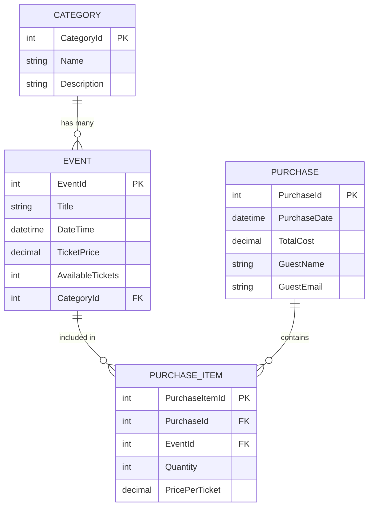

# Entity-Relationship Diagram (ERD)
## Virtual Event Ticketing System

## Database Schema

### Entities and Relationships

## Detailed Entity Descriptions

### 1. **Category**
- **Primary Key:** CategoryId (int, auto-increment)
- **Attributes:**
  - Name (varchar(100), NOT NULL)
  - Description (varchar(500), nullable)
- **Relationships:**
  - One-to-Many with Event (one category can have many events)

### 2. **Event**
- **Primary Key:** EventId (int, auto-increment)
- **Attributes:**
  - Title (varchar(200), NOT NULL)
  - DateTime (timestamp with time zone, NOT NULL)
  - TicketPrice (decimal(18,2), NOT NULL)
  - AvailableTickets (int, NOT NULL)
- **Foreign Keys:**
  - CategoryId → Category.CategoryId (RESTRICT on delete)
- **Relationships:**
  - Many-to-One with Category (many events belong to one category)
  - One-to-Many with PurchaseItem (one event can be in many purchase items)

### 3. **Purchase**
- **Primary Key:** PurchaseId (int, auto-increment)
- **Attributes:**
  - PurchaseDate (timestamp with time zone, NOT NULL)
  - TotalCost (decimal(18,2), NOT NULL)
  - GuestName (varchar(100), NOT NULL)
  - GuestEmail (varchar(100), NOT NULL, email format)
- **Relationships:**
  - One-to-Many with PurchaseItem (one purchase can have many purchase items)

### 4. **PurchaseItem** (Junction Table)
- **Primary Key:** PurchaseItemId (int, auto-increment)
- **Attributes:**
  - Quantity (int, NOT NULL, min: 1)
  - PricePerTicket (decimal(18,2), NOT NULL)
- **Foreign Keys:**
  - PurchaseId → Purchase.PurchaseId (CASCADE on delete)
  - EventId → Event.EventId (RESTRICT on delete)
- **Relationships:**
  - Many-to-One with Purchase (many purchase items belong to one purchase)
  - Many-to-One with Event (many purchase items reference one event)

## Relationship Types

### One-to-Many Relationships:
1. **Category → Event**
   - One category can have multiple events
   - Each event belongs to exactly one category
   - Delete behavior: RESTRICT (cannot delete category if events exist)

2. **Purchase → PurchaseItem**
   - One purchase can contain multiple purchase items
   - Each purchase item belongs to exactly one purchase
   - Delete behavior: CASCADE (deleting purchase removes all items)

3. **Event → PurchaseItem**
   - One event can appear in multiple purchase items
   - Each purchase item references exactly one event
   - Delete behavior: RESTRICT (cannot delete event if purchases exist)

### Many-to-Many Relationship:
**Purchase ↔ Event** (via PurchaseItem junction table)
- A purchase can include tickets for multiple events
- An event can be included in multiple purchases
- The PurchaseItem table stores the quantity and price per ticket for each event in a purchase

## Constraints and Validation

### Primary Keys:
- All tables use auto-incrementing integer primary keys
- Ensures unique identification of each record

### Foreign Keys:
- **Event.CategoryId** references Category.CategoryId
- **PurchaseItem.PurchaseId** references Purchase.PurchaseId
- **PurchaseItem.EventId** references Event.EventId

### Data Validation:
- **Event.TicketPrice:** Must be ≥ 0 (decimal(18,2))
- **Event.AvailableTickets:** Must be ≥ 0 (integer)
- **PurchaseItem.Quantity:** Must be ≥ 1 (integer)
- **Purchase.GuestEmail:** Must be valid email format
- **All Names/Titles:** Cannot be empty (NOT NULL)

## Indexes

### Automatic Indexes (from EF Core):
1. **IX_Events_CategoryId** - Index on Event.CategoryId (for faster category filtering)
2. **IX_PurchaseItems_PurchaseId** - Index on PurchaseItem.PurchaseId
3. **IX_PurchaseItems_EventId** - Index on PurchaseItem.EventId

These indexes improve query performance for:
- Filtering events by category
- Retrieving all items in a purchase
- Finding all purchases for an event

## Data Integrity Features

1. **Referential Integrity:** Foreign key constraints ensure valid relationships
2. **Normalization:** Database follows 3NF (Third Normal Form)
   - No repeating groups
   - All attributes depend on primary key
   - No transitive dependencies
3. **Cascade Rules:** Appropriate delete behaviors prevent orphaned records
4. **Data Types:** Proper types for monetary values (decimal), dates (timestamp), etc.

## Sample Data Flow

### Creating a Purchase:
1. User selects an Event (EventId from Events table)
2. System creates Purchase record (stores guest info, total cost)
3. System creates PurchaseItem record (links Purchase to Event, stores quantity)
4. System updates Event.AvailableTickets (decrements by quantity)

### Querying Events by Category:
1. Join Event table with Category table on CategoryId
2. Filter by Category.Name
3. Return event details with category information

## Notes for Assignment 2

The current schema supports future extensions:
- **Users table:** Can be added with foreign key to Purchase
- **Authentication:** Purchase.GuestEmail can link to Users.Email
- **Reviews/Ratings:** Can add EventReviews table with foreign key to Event
- **Sessions/Schedule:** Can add EventSessions table for multi-session events
